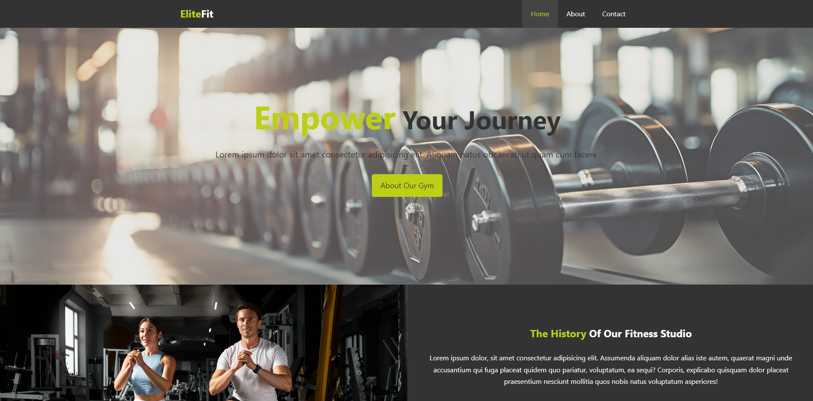

# Based on a course by Brad Traversy

## Table of contents

- [Overview](#overview)
  - [The challenge](#the-challenge)
  - [Screenshot](#screenshot)
  - [Links](#links)
- [My process](#my-process)
  - [Built with](#built-with)
- [Author](#author)

## Overview

### The challenge

-Responsive Design Implementation: Achieving a consistent and visually appealing layout across different screen sizes, particularly through the use of media queries, required careful consideration and testing.

-Customizing the Original Template: Adapting the structure and styling provided in the course to add a personalized mobile-friendly view and additional features, while maintaining clean and maintainable code.

-Cross-Browser Compatibility: Ensuring that the page renders correctly across various browsers, necessitating thorough testing and adjustments for compatibility.

### Screenshot

### Links

- Live Site URL: [Product Preview Card](https://mahbt.github.io/gym-landing-page/)

## My process

### Built with

- Semantic HTML5 markup
- CSS custom properties
- Flexbox

## Author

- Frontend Mentor - [@mahbt](https://www.frontendmentor.io/profile/mahbt)
